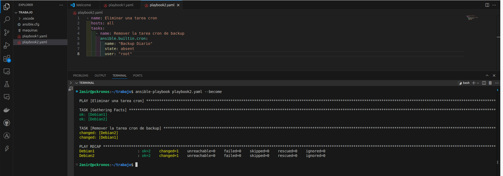

# 2: Eliminar una tarea cron existente

***

## Playbook:
```
- name: Eliminar una tarea cron
  hosts: all
  tasks:
    - name: Remover la tarea cron de backup
      ansible.builtin.cron:
        name: "Backup Diario"
        state: absent
        user: "root"
```


### Explicación:

`name`: Nombre de la tarea a eliminar.

`state`: absent: Indica que la tarea debe ser eliminada.

`user`: Usuario del que se eliminará la tarea.

### Resultado esperado en el servidor remoto:

```
$ crontab -l -u root
# (No output, la tarea fue eliminada)
```
